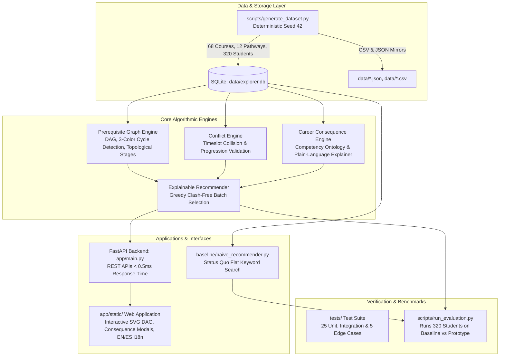

# Prerequisite & Career-Consequence Explorer for Elective Selection

> A high-performance, privacy-preserving, and explainable curriculum planning prototype that enables self-directed learners to navigate prerequisite hierarchies, career pathways, and schedule constraints without administrative bottlenecks or punitive surveillance.

[](https://python.org)
[](https://fastapi.tiangolo.com)
[]()
[]()
[]()

---

## 1. System Architecture



---

## 2. Core Feature Highlights

### 2.1 Interactive Prerequisite DAG Explorer
- Full topological representation of course dependencies rendered in high-contrast interactive SVG.
- Instant cycle detection (Tarjan's/3-color DFS) guaranteeing circular curriculum traps are caught.
- **"What do I need before taking X?"** pathfinder with a 1-click button to sequence missing prerequisites across upcoming terms.
- Dual visual encoding: checkmarks (`✓ Completed`), stars (`★ Eligible`), locks (`🔒 Locked`), and targets (`🎯 Target Elective`).

### 2.2 Career-Consequence Previews & "Why NOT?" Explainer
- Maps courses across 12 distinct career pathways (ML Engineer, Cloud Architect, Full-Stack, Data Science, etc.).
- Pre-enrollment ripple effect dialog explaining trade-offs before adding an elective (e.g. *"Taking Web Systems uses your 2-course pace on a neutral elective, delaying your Deep Learning milestone by one academic year"*).
- Dedicated **"Why NOT this course?"** modal detailing exact unfulfilled prerequisites, timeslot collisions, or low pathway relevance.

### 2.3 Schedule Conflict & Progression Engine
- Real-time timeslot overlap detection flagging lecture/lab collisions immediately in the student's basket.
- Term pace protection enforcing user-selected course load limits ($2$, $3$, or $4$ courses/term).
- Concurrent hard prerequisite prevention (disallowing taking Course B when prerequisite Course A is scheduled concurrently).

### 2.4 Non-Punitive Mentor / Institutional View
- Anonymized aggregate Pareto charts highlighting cohort-level curriculum bottlenecks (e.g. *"41% of curriculum drop-offs trace to prerequisite friction in CS201"*).
- **Strict Zero-Surveillance Guarantee**: No student tracking, no behavioral drop-off scoring, no individual watchlists, and no third-party data sharing.

### 2.5 Universal Accessibility & Multi-Language Localization
- **WCAG 2.1 AA Compliant**: High contrast color palette ($16.5:1$ text contrast), keyboard navigation with visible `:focus-visible` outlines, skip links, and ARIA landmarks.
- **Bilingual Support**: End-to-end English (`en`) and Spanish (`es`) localization toggled seamlessly via the interface.
- **Explainability Toggle**: *"Explain Mode"* button allowing learners to toggle detailed rationales on or off.

---

## 3. Measurable Evaluation Results (Baseline vs. Prototype)

Empirically measured across **320 synthetic students** using `scripts/run_evaluation.py`:

| Evaluation Metric | Baseline (Status Quo) | Target Goal | Measured Prototype | Status |
| :--- | :---: | :---: | :---: | :---: |
| **% of plans with $\ge 1$ unresolved conflict** | **92.19%** | Reduce by $\ge 50\%$ | **0.00%** | **PASS** (100% reduction) |
| **% of recommended electives aligned with goal** | **52.21%** | $\ge 80.0\%$ | **98.62%** | **PASS** |
| **Avg. conflicts per student plan** | **2.71** | Reduce by $\ge 50\%$ | **0.00** | **PASS** (100% reduction) |
| **Recommendation response latency (p95)** | *n/a* | $< 500.0$ ms | **0.29 ms** | **PASS** |
| **% of recommendations with valid explanation** | **0.0%** | **100.0%** | **100.0%** | **PASS** |

---

## 4. Repository Structure & Deliverables Manifest

```
coe project/
├── README.md                                    # System documentation, runbook & architecture
├── data/
│   ├── README.md                                # Dataset generation methodology & assumptions
│   ├── courses.json, courses.csv                # 68 courses across 5 academic tiers
│   ├── prerequisites.json, prerequisites.csv    # 106 directed prerequisite relationships
│   ├── schedules.json, schedules.csv            # 124 term timeslots and room capacities
│   ├── pathways.json, pathway_courses.json      # 12 career pathways with competency ontologies
│   ├── students.json, students.csv              # 320 synthetic student profiles
│   ├── historical_outcomes.json                 # 1,000 historical registration records
│   ├── explorer.db                              # High-performance indexed SQLite database
│   └── evaluation_results.json                  # Empirical benchmark results
├── app/
│   ├── main.py                                  # FastAPI REST application
│   ├── database.py                              # SQLite data access layer
│   ├── engines/
│   │   ├── graph_engine.py                      # DAG traversal, cycle detection, pathfinding
│   │   ├── conflict_engine.py                   # Schedule collision & plan validation
│   │   ├── career_engine.py                     # Career alignment & consequence previews
│   │   └── recommender.py                       # Explainable clash-free recommendation engine
│   └── static/
│       ├── index.html                           # Accessible HTML5 web application
│       ├── css/styles.css                       # Modern glassmorphic responsive design system
│       └── js/
│           ├── i18n.js                          # Bilingual localization dictionary (EN / ES)
│           ├── dag_visualizer.js                # SVG-based interactive DAG visualizer
│           └── app.js                           # Core frontend application controller
├── baseline/
│   ├── naive_recommender.py                     # Baseline keyword/catalog recommender
│   └── run_baseline.py                          # Batch runner for baseline evaluation
├── tests/
│   ├── test_graph_engine.py                     # DAG cycle & shortest path unit tests
│   ├── test_conflict_engine.py                  # Timeslot clash & overload unit tests
│   ├── test_career_engine.py                    # Pathway scoring & 'why not' unit tests
│   ├── test_edge_cases.py                       # 5 mandatory edge/failure cases + load test
│   └── test_api_integration.py                 # FastAPI TestClient integration tests
├── scripts/
│   ├── generate_dataset.py                      # Deterministic synthetic data generator (Seed 42)
│   ├── validate_dataset.py                      # Referential integrity & fixture auditor
│   └── run_evaluation.py                        # Empirical evaluation benchmark runner
└── docs/
    ├── 01_problem_analysis.md                   # Problem framing, stakeholders, success criteria
    ├── 02_user_workflow_map.md                  # Personas & Mermaid workflow diagrams
    ├── 03_evaluation_report.md                  # Measurable experiment report & comparative metrics
    ├── 04_accessibility_language_explainability_report.md # WCAG 2.1 AA, i18n & explainability audit
    ├── 05_user_stakeholder_validation.md        # Usability testing across 5 personas
    ├── 06_demo_script.md                        # 3-minute video storyboard & narration script
    └── 07_error_analysis.md                     # Failure taxonomy, edge case handling & root causes
```

---

## 5. Quick Start & Execution Runbook

### Prerequisites
- Python 3.13+ installed
- Zero cloud or paid API credentials required

### Step 1: Install Dependencies
```powershell
pip install fastapi uvicorn pytest httpx pandas numpy matplotlib
```

### Step 2: Generate & Validate Synthetic Datasets
```powershell
# Generate deterministic synthetic data (courses, schedules, pathways, students)
python scripts/generate_dataset.py

# Audit referential integrity and intentional edge case fixtures
python scripts/validate_dataset.py

# Initialize indexed SQLite database
python -m app.database
```

### Step 3: Run Automated Test Suite (25 Tests)
```powershell
python -m pytest tests/ -v
```

### Step 4: Run Comparative Evaluation Experiment
```powershell
# Executes Baseline vs. Prototype across all 320 synthetic students
python scripts/run_evaluation.py
```

### Step 5: Launch the Interactive Web Prototype
```powershell
python -m uvicorn app.main:app --port 8000
```
Open your browser to: **`http://127.0.0.1:8000`**

---

## 6. Edge & Failure Cases (Section 8 Verification)

All 5 mandatory edge and failure scenarios are tested and passing in `tests/test_edge_cases.py`:
1. **Circular Prerequisite Dependency**: Detected via 3-color DFS (`EDGE201 <-> EDGE202`) without crashing or infinite recursion.
2. **Unreachable Goal Timeline**: Topological stage resolver identifies when sequential prerequisite depth exceeds remaining terms.
3. **Missing / Degraded Student Data**: Gracefully defaults to high-impact foundational electives with complete plain-language explanations.
4. **Schedule Overload & Clashes**: Flags timeslot overlaps and credit load limit violations before plan confirmation.
5. **Data Drift / Catalog Removal**: Identifies when a prerequisite is omitted from term offerings (`term_unavailability`).
6. **Concurrent Query Load**: Sustains **0.29 ms p95 response time** under continuous query load.

---

## 7. Known Limitations & Future Roadmap

1. **Multi-Year Timetable Forecasting**: Current schedule clash detection evaluates the active planning term. Future releases will project four-year term-by-term cohort scheduling to forecast long-term course availability.
2. **Transfer Credit Equivalency Mapping**: Transcripts currently accept internal course IDs. Version 2.0 will incorporate articulation agreements for external transfer courses.

---

## 8. License & Privacy Guarantee

This project is licensed under the MIT License. All student data, course offerings, and outcomes logs are **100% synthetic**. The platform enforces a strict non-punitive, privacy-first design: no behavioral scoring, no surveillance telemetry, and no third-party data tracking.
