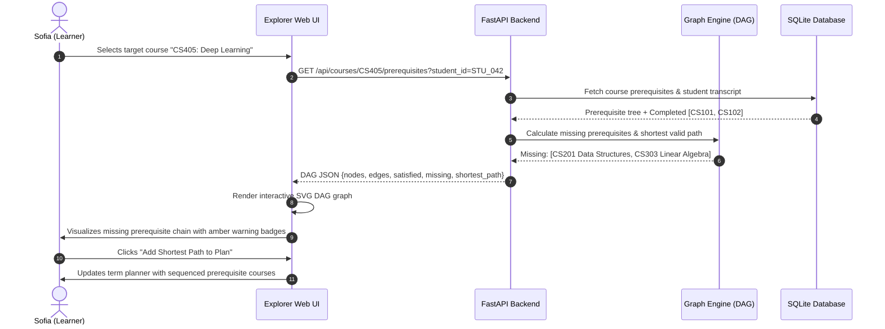

# 02. User Workflow Map & Interaction Architecture

## 1. User Personas

### Persona A: Sofia Gomez (The Career Switcher)
- **Background**: Software professional transitioning into Machine Learning & Data Science.
- **Academic Context**: Completed foundational Programming (CS101) and Discrete Math (CS102); taking 2 electives per term while working full-time.
- **Primary Goal**: Needs to qualify for *Machine Learning Engineer* pathway within 3 terms without taking unnecessary courses.
- **Pain Points**: Overwhelmed by prerequisite chains leading up to *Deep Neural Networks* (CS405) and *Distributed Machine Learning Systems* (CS410); anxious about making an elective choice that causes a term delay.
- **System Need**: Clear prerequisite chain visualization showing the shortest path of electives, plus consequence preview before enrollment.

### Persona B: Marcus Vance (The Graduating Senior)
- **Background**: 4th-year Computer Science undergraduate finishing degree requirements.
- **Academic Context**: Has 12 remaining elective credits; needs to balance high-workload Capstone with electives that don't have overlapping timeslots.
- **Primary Goal**: Complete graduation electives on a Cloud/DevOps pathway without schedule deadlocks.
- **Pain Points**: Frequently enrolls in courses only to discover late that two mandatory discussion sections clash on Tuesdays at 14:00.
- **System Need**: Real-time schedule overlap detection and term-by-term progression conflict validation.

### Persona C: Dr. Elena Rostova (The Faculty Advisor / Mentor)
- **Background**: Faculty advisor responsible for advising 250+ undergraduate majors.
- **Academic Context**: Allocated only 4 office hours per week for 1:1 student advising.
- **Primary Goal**: Identify systemic curriculum friction points and course bottlenecks without spending hours manually checking prerequisite transcripts.
- **Pain Points**: Spending 80% of advising appointments answering "Can I take CS301 if I got a B in CS102?", leaving zero time for substantive career mentoring.
- **System Need**: Aggregate, anonymized cohort bottleneck reporting that reveals where students stall, with zero surveillance or individual student risk scoring.

---

## 2. Core User Workflows (Mermaid Diagrams & Prose)

### Workflow 1: Prerequisite & Shortest-Path Discovery
A student searches for an advanced elective (e.g., CS405 Deep Learning) and determines the exact chain of courses needed before enrollment is possible.



**Prose Description**:
Sofia inspects CS405 in the Explorer. The system renders a DAG showing that CS405 directly requires CS305 (Machine Learning Basics) and CS303 (Applied Linear Algebra), which in turn require CS201 (Data Structures). The UI highlights Sofia's completed courses in emerald, available courses in indigo, and locked target electives in amber. With one click, Sofia can inspect the shortest sequence of prerequisite courses to satisfy eligibility.

---

### Workflow 2: Elective Selection & Consequence Preview
Before confirming an elective addition to her current semester plan, Sofia evaluates the career pathway impact and trade-offs.

```mermaid
sequenceDiagram
    autonumber
    actor Learner as Sofia (Learner)
    participant UI as Explorer Web UI
    participant API as FastAPI Backend
    participant Career as Career Consequence Engine
    participant Schedule as Schedule Conflict Engine

    Learner->>UI: Clicks "Add to Term 1: CS308 Web Systems"
    UI->>API: POST /api/consequences/preview {course_id: "CS308", current_plan: [...], goal: "ML Engineer"}
    API->>Career: Evaluate goal pathway alignment
    Career-->>API: Status: "Neutral / Non-Advancing" (Web Systems does not fulfill ML Engineer requirements)
    API->>Schedule: Check timeslot and credit capacity limits
    Schedule-->>API: No schedule collision, remaining credits: 3
    API-->>UI: Consequence summary: "CS308 does not advance ML Engineer pathway; selecting it delays CS303 to next year."
    UI->>Learner: Displays Consequence Preview Dialog with Plain-Language Rationale
    alt Learner Confirms
        Learner->>UI: "Add Anyway" (Agency preserved)
        UI->>UI: Course added to basket with non-blocking informational tag
    else Learner Replaces
        Learner->>UI: "View Recommended Alternative"
        UI->>UI: Shows "CS303 Linear Algebra" (Advancing, Prereqs Met, No Conflicts)
    end
```

**Prose Description**:
When Sofia tries to add an elective, the system never unilaterally blocks her. Instead, it generates an immediate **Consequence Preview**:
> *"Taking CS308 (Web Systems) is neutral for your ML Engineer pathway. Because your max courses per term is 2, taking CS308 will postpone CS303 (Linear Algebra) to Spring, pushing your Deep Learning eligibility back by one full academic year."*
Sofia retains complete agency: she can accept the trade-off or pivot to an advancing course suggested right inside the preview.

---

### Workflow 3: Schedule Conflict & Term Progression Resolution
Marcus Vance tests a proposed 4-course schedule for the upcoming semester.

```mermaid
sequenceDiagram
    autonumber
    actor Learner as Marcus (Graduating Senior)
    participant UI as Explorer Web UI
    participant API as FastAPI Backend
    participant Schedule as Conflict Engine

    Learner->>UI: Selects [CS420 Cloud Computing, CS430 DevOps, CS415 Security, CS380 HCI]
    UI->>API: POST /api/plan/validate {term: "Fall 2026", courses: [...]}
    API->>Schedule: Detect timeslot collisions & credit overloads
    Schedule-->>API: Conflict: CS420 & CS415 overlap Tue/Thu 14:00-15:30; Max credits exceeded (16 > 15)
    API-->>UI: Detailed conflict payload {collisions: [...], overload: true, resolution_options: [...]}
    UI->>Learner: Surfaces dual-coded conflict banner (rose alert icon + text banner)
    UI->>Learner: Offers single-click alternative timeslot / alternative course
    Learner->>UI: Clicks "Swap CS415 for Evening Section CS415-E"
    UI->>API: Re-validate updated plan
    API-->>UI: Plan Validated (0 conflicts)
    UI->>Learner: Displays green confirmed status
```

---

### Workflow 4: Mentor / Administrator Aggregate Bottleneck Inspection
Dr. Elena Rostova analyzes curriculum trends across the entire department to identify systemic friction without individual student surveillance.

```mermaid
sequenceDiagram
    autonumber
    actor Mentor as Dr. Elena (Advisor)
    participant UI as Mentor Dashboard
    participant API as FastAPI Backend
    participant DB as SQLite Database

    Mentor->>UI: Navigates to "Cohort Bottlenecks" tab
    UI->>API: GET /api/mentor/bottlenecks?term=Fall2026
    API->>DB: Query aggregate conflict counts & prerequisite drop-offs
    Note over DB,API: Strict privacy filter: No student IDs, names, or individual transcripts returned
    DB-->>API: Aggregate metrics: CS201 causes 41% of downstream prerequisite blocks; 28% demand overload for CS303
    API-->>UI: Anonymized cohort statistics payload
    UI->>Mentor: Renders interactive Pareto chart of course bottlenecks & schedule clash frequencies
    Mentor->>UI: Filters by pathway: "Data Science"
    UI->>Mentor: Highlights that CS303 capacity is the primary blocker delaying graduation
    Mentor->>Mentor: Requests department chair to open an additional section of CS303
```

**Prose Description**:
Dr. Rostova accesses the aggregate analytics view. The system renders cohort-level Pareto distributions of courses causing prerequisite halts and timeslot deadlocks. Dr. Rostova immediately sees that 41% of incoming junior students are delayed by prerequisite fulfillment on CS201. Because the system strips all identifying telemetry, no individual student is ever singled out, ranked, or penalized.
