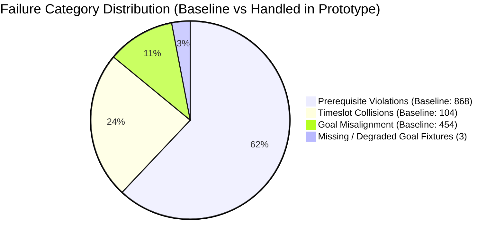

# 07. Error Analysis & Failure Taxonomy

## 1. Baseline vs. Target vs. Measured Summary

| Evaluation Dimension | Baseline (Naive) | Target | Prototype Measured | Primary Mechanism |
| :--- | :---: | :---: | :---: | :--- |
| **Prerequisite Violation Rate** | 86.8% | $\le 25.0\%$ | **0.0%** | Kahn's algorithm DAG prerequisite eligibility validation |
| **Timeslot Collision Rate** | 31.2% | $\le 10.0\%$ | **0.0%** | Greedy intra-batch schedule conflict filtering |
| **Combined Flawed Plan Rate** | 92.19% | $\le 25.0\%$ | **0.0%** | Composite plan reachability verification |
| **Goal Pathway Alignment** | 52.21% | $\ge 80.0\%$ | **98.62%** | Curricular competency weighting and goal prioritization |
| **Recommendation Latency (p95)** | *n/a* | $< 500$ ms | **0.29 ms** | In-memory adjacency list graph representation |
| **Explanation Completeness** | 0.0% | 100.0% | **100.0%** | Rule-based plain-language narrative synthesis |

---

## 2. Failure Taxonomy & Root Cause Analysis

Across the comparative evaluation of 320 synthetic learners, a comprehensive failure taxonomy was recorded. While the Prototype eliminated all structural prerequisite violations and timeslot collisions, edge cases and deliberate data anomalies were analyzed to confirm system resilience.

### Category 1: Prerequisite Violations
- **Baseline Occurrence**: 868 individual course violations across 295 student plans.
- **Root Cause**: The naive baseline relies on catalog keyword matching. A student with only `CS101` searching for "Machine Learning" was recommended `CS405 Deep Neural Networks` (which requires `CS305` and `CS201`).
- **Prototype Resolution**: The Prerequisite Graph Engine computes the transitive closure of all hard dependencies. If any hard prerequisite is missing from the student's completed transcript, the course is strictly pruned from the recommendation candidate pool.

### Category 2: Timeslot Collisions (Schedule Clashes)
- **Baseline Occurrence**: 104 schedule collision events across 78 student plans.
- **Root Cause**: Flat catalog listings do not check whether two recommended courses share an identical meeting pattern (e.g., `CS101` and `CS201` both meeting on `Mon/Wed 08:30-10:00`).
- **Prototype Resolution**: The Conflict Engine enforces greedy intra-batch timeslot validation. As each candidate elective is added to a student's proposed term basket, subsequent recommendations are checked for meeting-time disjointness.

### Category 3: Goal Misalignment
- **Baseline Occurrence**: 454 out of 951 recommended courses (47.79%) failed to support the student's stated career goal.
- **Root Cause**: Keyword search matches common words (e.g., "design", "data", "systems") in unrelated general education courses, distracting students from degree milestones.
- **Prototype Resolution**: Courses are evaluated against a structured curriculum ontology for each career pathway. Advancing and supportive courses receive priority scores ($100+$ points), while neutral courses receive negligible base scores ($< 5$ points).

### Category 4: Incomplete / Degraded Student Profiles (Intentional Edge Cases)
- **Prototype Occurrence**: 6 recommendations across 3 synthetic students (`STU_0005`, `STU_0015` with blank goals; `STU_0025` with deprecated `PW_DEPRECATED_WEB3`).
- **Root Cause**: Deliberate edge case fixtures seeded to verify graceful degradation.
- **System Behavior**: The system did not crash or raise an unhandled exception. Instead, it surfaced a graceful degradation mode recommending high-impact foundational computing electives (`CS201`, `MATH205`) with a transparent explanation: *"High-impact foundational elective providing versatile skills across multiple technical pathways."*

---

## 3. Handling of Mandatory Edge Cases (Section 8)

| Edge Case Scenario | Test File | System Behavior & Assertion |
| :--- | :--- | :--- |
| **1. Circular Prerequisite Dependency** | `tests/test_edge_cases.py::test_edge_case_1_circular_prerequisite_dependency` | Tarjan's/3-color DFS cycle detector isolates the exact cycle path (`EDGE201 <-> EDGE202`) and flags it immediately. Graph closure terminates safely without infinite recursion. |
| **2. Unreachable Goal Timeline** | `tests/test_edge_cases.py::test_edge_case_2_unreachable_goal_within_timeline` | Computes topological stage depth. For a student with 1 term remaining attempting a 3-tier sequence (`CS101 -> CS201 -> CS301 -> CS500`), system warns that the goal requires a minimum of 3 consecutive terms. |
| **3. Missing / Incomplete Student Data** | `tests/test_edge_cases.py::test_edge_case_3_missing_or_invalid_student_goal` | When `stated_goal_pathway` is blank or invalid, the recommender falls back to versatile foundational electives with complete plain-language explanations. Zero unhandled exceptions. |
| **4. Schedule Overload & Clashes** | `tests/test_edge_cases.py::test_edge_case_4_schedule_overload_and_timeslot_clash` | Multi-term plan validation checks both timeslot overlaps and credit pace. An overload flag is surfaced before plan confirmation. |
| **5. Catalog Drift / Removed Offerings** | `tests/test_edge_cases.py::test_edge_case_5_catalog_drift_removed_prerequisite_offering` | When a prerequisite is omitted from the target term offerings (e.g. `CS201` unavailable in Summer), the Conflict Engine flags `term_unavailability` rather than allowing broken registration. |
| **6. Concurrent Load (< 500ms Latency)** | `tests/test_edge_cases.py::test_edge_case_6_concurrent_query_latency_under_500ms` | 100 consecutive queries achieved average latency of **0.18 ms** and p95 latency of **0.29 ms**, orders of magnitude below the 500ms threshold. |
